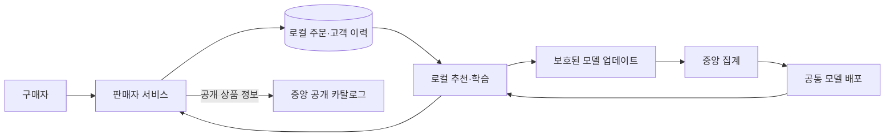

# 연합 커머스 플랫폼

판매자별 거래 데이터를 로컬에 보관하면서 공통 추천 모델을 학습하는 팀프로젝트입니다. 서로 다른 상품 목록을 가진 판매자와 구매 이력이 없는 신상품을 대상으로 추천·학습·서비스 연결을 검증합니다.

## 현재 상태

현재 구현된 범위는 **JSON 계약 스키마·검증기, A/B/C 공통 Python 인터페이스와 서비스 기동 뼈대**입니다. 구매·판매 서비스, 추천 모델 학습, 연합학습과 보호 집계는 개발 예정이며 성능·보안 검증이 완료된 상태가 아닙니다.

## 목표 구조



- **서비스:** 판매자별 주문 처리와 완료 거래 기록, 로컬 추천.
- **모델:** 고정 텍스트 표현과 로컬 구매 관계를 결합한 다음 구매 상품 예측.
- **학습:** 공통 추천 가중치의 연합학습과 판매자별 후반부 개인화.
- **데이터 경계:** 거래·고객 이력·특징은 로컬 보관. 최종 학습 경로에서는 개별 평문 업데이트를 중앙에 전달하지 않는 보호 집계를 목표로 합니다.

## 데이터와 평가 계획

Dunnhumby와 Instacart를 판매자 단위로 분할한 시뮬레이션을 사용합니다. 점포·가상 client 분할을 실제 독립 기업의 관측 자료라고 해석하지 않습니다. 두 출처 모두 식료품 중심이므로 모든 업종으로의 이전 효과를 가정하지 않습니다.

텍스트 기반 모델과 관계 결합 모델을 각각 학습하고 개인화 전후를 비교합니다. FL 효과는 같은 구조의 로컬 단독 학습과 비교하며, 신규 판매자와 구매 무이력 상품을 별도로 평가할 계획입니다. 초기 실행은 작은 고정 표본부터 시작합니다.

## 개발 시작

**사람과 에이전트 모두 [AGENTS.md](AGENTS.md)를 먼저 읽습니다.** 공통 규칙·소유권·검사 기준이 거기 있고, 도구별 지시 파일(`CLAUDE.md` 등)은 그 문서를 가리키는 포인터일 뿐입니다. 이후 순서는 [팀 시작 안내](docs/team/start.md) → 자기 역할 카드이며, 설계 문서를 미리 다 읽을 필요는 없습니다.

전체 목록은 **[문서 목차](docs/README.md)**에 있습니다.

- 처음 참여: [AGENTS.md](AGENTS.md) → [팀 시작 안내](docs/team/start.md) → 자기 역할 카드. 이 저장소의 `main`이 공동 기준이며 작업은 `commerce/a|b|c/<작업명>` 브랜치에서 하고 PR의 base는 `main`입니다.
- 설치·호출 규격: [개발 안내](docs/development.md).
- 설계 그림: [아키텍처](docs/design/architecture.md).
- 미확정 내용: [열린 구현 항목](docs/design/open-questions.md).

팀원과 개발 도구는 같은 공개 문서를 사용합니다. 별도 내부 ZIP은 필요 없습니다.

## 계약·뼈대 검사

Python 3.11 가상환경에서 개발 의존성을 준비한 뒤 프로젝트 루트에서 실행합니다.

```text
python -m pip install -r commerce/requirements-lock.txt
python -m commerce.tools.gate contracts
python -m commerce.tools.gate scaffold
python -m commerce.tools.gate docs
python -m commerce.tools.gate policy
python -m commerce.deploy.run_local --smoke --merchants 2
```

성공하면 종료 코드 0과 다음 형식의 요약이 출력됩니다. 개수는 실행 시 집계합니다.

```text
CONTRACTS OK: schemas=<n> fixtures=<n> failures=0
```

이 검사는 입력 형태와 일부 의미 규칙을 확인합니다. 실제 주문 복구·모델 품질·보호 집계 동작을 검증하는 것은 아닙니다. `scaffold`는 객체 연결과 미구현 경계를 검사하고, 로컬 smoke는 health-only 프로세스를 기동했다가 종료합니다. 업무 게이트는 현재 `NOT_IMPLEMENTED`와 종료 코드 3을 반환합니다.

## 구성

| 경로 | 내용 |
| --- | --- |
| [commerce/packages/contracts](commerce/packages/contracts/README.md) | 스키마·정상/오류 예제·검증기 |
| [commerce/tools/gate.py](commerce/tools/gate.py) | 검증 진입점 |
| [docs/contracts.md](docs/contracts.md) | 계약 범위와 검증 상태 |
| [fedcommerce/](fedcommerce/README.md) | 이전 탐색 분석 스크립트 (참고용, 구현 코드 아님) |

기존 Graph-FL 연구는 Git 이력에 보존합니다. [fedcommerce/](fedcommerce/README.md)의 이전 탐색 분석 스크립트는 B의 출발점으로만 공개한 참고 자료이며 현행 계약을 따르지 않고 게이트 대상도 아닙니다.

원자료·개인별 파생 데이터·DB·모델 파일·인증 정보는 저장소에 포함하지 않습니다. 구현이 진행되면 재현 방법과 측정 결과를 해당 변경과 함께 갱신합니다.
