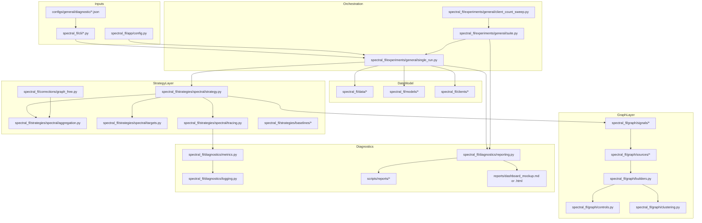
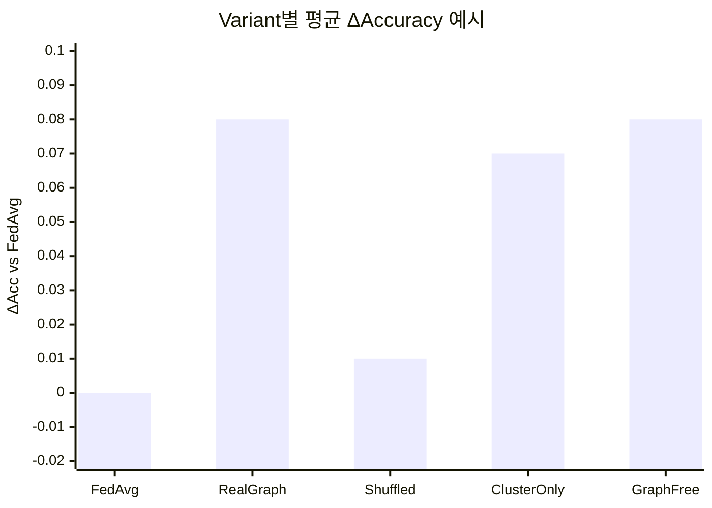
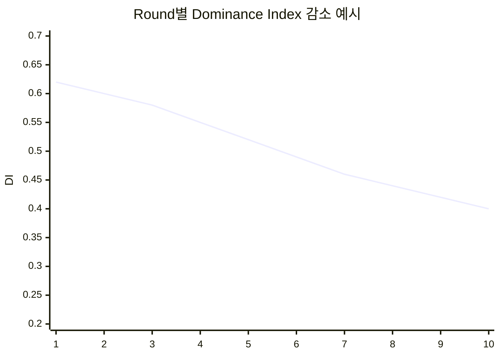

# Graph 기반 연합학습 실험-진단 프레임워크 전환 설계 보고서

## 요약

대상 저장소인 urlCSID-DGU/2026-1-CECD1-3-JeonYeoGyeong-11turn2view0 은 이미 `spectral_fl/graph`, `spectral_fl/strategies/spectral`, `spectral_fl/experiments/general`, `configs/general`, `scripts`, `tests`, `.github/workflows/ci.yml`로 책임을 분리한 상태이고, 문서에서도 “변경은 가장 좁은 모듈에 넣고 compatibility facade는 얇게 유지하라”는 원칙을 명시한다. 현재 문제는 구조 부재가 아니라, 실험이 “graph가 정말 의미 있는가”를 판별할 만큼 진단형으로 완성되지 않았다는 점이다. citeturn3view0turn22view0

지금 저장소의 연구 방향도 이미 진단형 프레이밍에 가깝다. README와 실험 설계 문서는 “FedAvg보다 항상 좋다”가 아니라 “client relation graph가 실제로 의미 있는 aggregation signal을 만드는지 검증한다”를 목표로 두고 있고, current results 문서는 raw update spectral-only가 약하고 불안정하며 random-matched control이 강하고, 핵심 병목은 graph construction이라고 적고 있다. 즉 지금 필요한 것은 새 알고리즘을 더 얹는 것이 아니라, control graph, clustering-only, graph-free correction, round/client diagnostics, 재현 가능한 suite reporting을 정식 구조로 올리는 것이다. citeturn3view0turn23view0turn24view0

가장 안전한 전환 경로는 기존 general-FL 트랙과 Flower 전략 확장 지점을 그대로 재사용하는 것이다. Flower는 서버 측 학습 흐름을 Strategy abstraction으로 바꾸도록 설계되어 있고, custom strategy의 핵심 진입점도 `start` 또는 서버 전략 오버라이드 쪽이다. 따라서 현재 `strategies/spectral/strategy.py`를 중심으로 하되, 그래프 control·보정은 좁은 파일로 분리하고, 진단 지표와 리포팅은 새 패키지로 분리하는 것이 구조 원칙과 구현 현실성을 둘 다 만족한다. citeturn20view0turn20view1turn22view0

하드웨어, 템플릿 세부 항목, 저장소의 비공개 추가 문서 여부는 명시되지 않았다. 아래 계획은 공개 저장소 기준, CPU에서도 돌아가는 smoke/config 우선, static report와 dashboard mockup 중심, 기존 wrapper 유지 원칙을 전제로 한다. Flower Simulation Runtime은 Ray 기반이고 Linux/macOS를 정식 지원하며 Windows는 실험적이므로, Windows 환경이면 WSL2를 기본 가정으로 두는 편이 안전하다. citeturn20view2turn15view0

## 현재 저장소 진단

현재 저장소는 실험-진단 프레임워크로 바꾸기 좋은 토대를 이미 갖고 있다. `graph_source`, `graph_mode`, `aggregation_target`, baseline 세트, `run_general_experiment.py`, `run_general_suite.py`, `run_general_client_count_sweep.py`, `run_general_stress_grid.py`, 그리고 suite summary/CSV/interpretation 산출 경로가 이미 있다. single-run metadata도 `experiment`, `graph`, `tau`, `aggregation`, `baselines`, `compression` 블록을 JSON으로 남기므로, 여기에 `diagnostics`, `correction`, `artifacts` 블록을 추가하는 것이 자연스럽다. citeturn3view0turn16view0turn18view1

반대로 지금 부족한 것은 “진단 프레임워크”에 필요한 통제 실험과 기록 계층이다. 공식적으로 노출된 graph mode 목록에는 `dense`, `knn`, `mutual_knn`, `threshold`, `random`, `uniform`, `magnitude`, `rbf`, `negative`, `learned_smooth`가 있으나, 사용자가 요구한 `shuffled`, `identity`, `clustering-only`는 보이지 않는다. 또한 aggregation 쪽에는 `compute_effective_clients` 같은 일부 진단 함수가 이미 있지만, DI·alignment·leave-one-out distortion을 round/client CSV 수준으로 남기는 구조는 드러나지 않는다. 실험 결과 문서에 적힌 client ordering bug를 보면, “diagnostic logging의 정식화”가 연구 품질뿐 아니라 재현성에도 직접 연결된다. citeturn10view0turn10view1turn23view0turn24view0

| 구분 | 현재 강점 | 현재 공백 | 설계 판단 |
|---|---|---|---|
| 구조 | 책임 분리 트리, thin facade 규칙, config 질문 단위 분류 | 진단 패키지 부재 | 트리 유지, 진단/보정 패키지만 추가 |
| 그래프 | real graph, random/uniform control, head/EMA/weight source 존재 | shuffled/identity/block-uniform 부재 | control graph 모듈 신설 |
| 전략 | spectral strategy, baselines, weight selection, effective clients 일부 존재 | graph-free correction family 부재 | 보정 family switch 추가 |
| 실험 | single run, suite, sweep, stress grid 존재 | round/client diagnostics artifact 부재 | single_run/suite에 artifact writer 추가 |
| 리포팅 | suite summary JSON/CSV, interpretation.md 존재 | round-level CSV, client-level CSV, plot bundle, dashboard mockup 부재 | reporting layer 확장 |
| 재현성 | seed, graph_seed, fixed_tau, config-driven 실행 존재 | cid-ordering regression protection 불명확 | sort-by-cid 회귀 테스트 필수 |
| 품질 관리 | GitHub Actions smoke CI, unittest discover 존재 | deep-tree compile 누락, pytest 기반 param sweep 미흡 | compileall + pytest 추가 |

표의 판단 근거는 저장소 구조 문서, README/설계 문서, 현재 suite writer, CI 파일, 그리고 실험 결과 로그에 있다. 특히 “가장 좁은 모듈에 변경을 넣고, 새 diagnostics는 측정 책임이 있는 모듈에서 산출한 뒤 experiment reporting에서 집계하라”는 기존 규칙은 그대로 유지해야 한다. citeturn22view0turn18view1turn7view0turn24view0

## 개정 아키텍처

핵심 원칙은 단순하다. 기존 저장소를 새 프로젝트로 갈아엎지 말고, 현재 general-FL 실험 파이프라인 위에 “보정 family”와 “진단 artifact layer”를 얹는다. 그래프를 만드는 코드는 `graph/`, 서버 쪽 correction·aggregation은 `strategies/`, run orchestration과 결과물 저장은 `experiments/`, 최종 CSV/plot/report는 `diagnostics/`와 `scripts/reports/`로 분리한다. 이 배치는 저장소가 이미 정의한 boundary rule과 맞다. citeturn22view0turn20view0



이 구조에서 새로 추가할 핵심은 네 군데다. `graph/controls.py`는 real graph와 별개로 shuffled/uniform/identity/random을 만들고, `graph/clustering.py`는 clustering-only/block-uniform control을 만든다. `corrections/graph_free.py`는 norm clipping, contribution cap, dominance reweight를 담당한다. `diagnostics/`는 round/client diagnostics를 CSV/JSON/plot으로 정리한다. 현재 저장소 문서가 이미 `graph_mode`는 `graph/builders.py`, client weight/conflict weight는 `strategies/spectral/aggregation.py`, suite reporting은 `experiments/suites/general/reporting.py`에서 처리하라고 가이드하므로, 실제 PR도 그 경계를 따라야 한다. citeturn22view0turn10view0turn10view1turn18view1

권장 입력 config 형식은 “입력은 flat JSON/CLI, 저장은 resolved nested JSON”이다. 지금 저장소가 argparse namespace 기반으로 움직이고 `single_run.py`가 nested metadata를 쓰고 있으므로, 입력 포맷까지 새 프레임워크로 갈아타는 것은 이득보다 비용이 크다. 그대로 flat flag를 유지하되, 실행 시 `config_resolved.json`을 nested 구조로 쓰면 된다. citeturn16view0turn22view0

```json
{
  "method": "ours",
  "dataset": "fashionmnist",
  "model": "mlp",
  "num-clients": 20,
  "rounds": 10,
  "partition": "dirichlet",
  "dirichlet-alpha": 0.03,
  "seed": 42,

  "correction-family": "real_graph",
  "control-graph-mode": "shuffled",
  "cluster-method": "hierarchical",
  "cluster-k": 0,
  "graph-free-mode": "none",
  "graph-free-gamma": 1.0,
  "contribution-cap": 0.35,
  "clip-quantile": 0.90,

  "graph-source": "classifier_head_update",
  "graph-mode": "knn",
  "knn-k": 1,
  "aggregation-target": "spectral_filtered_update",

  "diagnostics-enable": true,
  "save-round-graphs": true,
  "graph-snapshot-rounds": "0,1,9",
  "save-update-arrays": false,
  "loo-enabled": true
}
```

이 예시는 현재 flat-arg/config 스타일을 유지하면서 diagnostic family만 확장하는 방향이다. `graph_mode`와 `correction_family`를 분리해두면 random/uniform은 “control”로도, real graph 모드로도 혼동 없이 기록할 수 있다. citeturn15view0turn16view0

## 모듈별 구현 명세

아래 명세는 “대규모 재작성 없이, autonomous agent가 PR 단위로 구현 가능”하도록 파일 위치와 API를 구체화한 것이다. 파일 배치는 저장소의 narrowest-module 원칙을 따른다. citeturn22view0

### 구성·실행 계층

| 모듈 | 파일 | 핵심 함수/API | 입력 | 출력 | 신규 config 키 | 로그/파일 | 테스트 포인트 |
|---|---|---|---|---|---|---|---|
| 실행 config 확장 | `spectral_fl/app/config.py` 수정 | `add_diagnostic_args(parser)`, `namespace_to_resolved_config(ns)` | argparse Namespace | resolved dict | `correction-family`, `control-graph-mode`, `cluster-*`, `graph-free-*`, `diagnostics-*` | `config_resolved.json` | default 값, flat→nested resolve, backward compatibility |
| CLI thin wrapper | `spectral_fl/cli/general_experiment.py`, `general_suite.py` 수정 | parser에 신규 옵션 등록만 수행 | CLI args/JSON config | Namespace | 동일 | 없음 | facade thinness, import-only, help text |
| 단일 실행 orchestrator | `spectral_fl/experiments/general/single_run.py` 수정 | `build_general_meta(...)`, `prepare_artifact_layout(...)`, `run(args)` | resolved config, class distribution | run meta dict, run dir | `out-dir`, `graph-snapshot-rounds`, `save-update-arrays` | `run_meta.json`, `partition_summary.json`, `logs/run.log` | metadata contains diagnostic/correction blocks |
| suite orchestrator | `spectral_fl/experiments/general/suite.py` 수정 | `run_suite(...)`, `merge_diagnostic_rows(...)` | variant list, seed list | suite summary, rows, diagnostic bundle | `seeds`, `suite-tag` | `general_suite_summary.json/csv`, `diagnostic_summary.csv`, `interpretation.md` | multi-seed merge correctness, missing-run handling |
| report aggregation | `spectral_fl/experiments/suites/general/reporting.py` 수정 | `write_diagnostic_csv(...)`, `write_dashboard_mockup(...)`, `write_verdicts(...)` | per-run rows | CSV/MD/HTML | `dashboard-format` | `plots/*.png`, `reports/*.md/.html` | stable schema, summary ranking, verdict rules |

현재 single-run은 이미 `experiment`, `graph`, `tau`, `aggregation`, `baselines`, `compression`을 nested meta로 쓰고 있고, suite는 `general_suite_summary.json`, `general_suite_rows.json`, `general_suite_summary.csv`, `knn_vs_random_matched.csv`, `interpretation.md`를 저장한다. 따라서 신규 구현은 이에 `diagnostic_summary.csv`, `round_metrics.csv`, `client_metrics.csv`, `graph_stats.csv`, `dashboard_mockup.md`를 추가하는 형태가 가장 자연스럽다. citeturn16view0turn18view1

### 그래프·보정 계층

| 모듈 | 파일 | 핵심 함수/API | 입력 | 출력 | 신규 config 키 | 로그/파일 | 테스트 포인트 |
|---|---|---|---|---|---|---|---|
| real/control graph dispatcher | `spectral_fl/graph/builders.py` 수정 | `build_client_graph(...)`, `build_relation_graph(...)` | `z_mat`, mode, seed | `adj: np.ndarray`, `graph_meta` | `correction-family`, `control-graph-mode` | `graph_stats.csv`, snapshot NPZ | symmetry, non-negativity, shape |
| control graphs | `spectral_fl/graph/controls.py` 신규 | `build_random_matched_graph`, `build_shuffled_graph`, `build_uniform_graph`, `build_identity_graph` | real graph 또는 `z_mat`, rng | control adjacency | `control-graph-mode`, `shuffle-seed` | `graph_snapshots/round_x_control_*.npz` | random edge count match, shuffled preserves topology/weight multiset, identity no cross-client edges |
| clustering-only | `spectral_fl/graph/clustering.py` 신규 | `cluster_clients(z_mat, method, k, seed)`, `build_block_uniform_graph(cluster_ids, intra, inter)` | `z_mat` | `cluster_ids`, block graph | `cluster-method`, `cluster-k`, `cluster-auto-k` | `cluster_assignments.csv`, `cluster_graph.npz` | deterministic clustering with seed, row normalization, block structure |
| graph-free correction | `spectral_fl/corrections/graph_free.py` 신규 | `apply_norm_clip`, `compute_contribution_cap_weights`, `apply_dominance_reweight`, `resolve_graph_free_correction` | client updates, sample weights | corrected updates or weights | `graph-free-mode`, `clip-quantile`, `contribution-cap`, `graph-free-gamma` | `round_metrics.csv`, `client_metrics.csv` | DI 감소, cap 만족, seed reproducibility |
| spectral aggregation hook | `spectral_fl/strategies/spectral/aggregation.py` 수정 | `select_aggregation_weights(...)` 래핑, `apply_correction_family(...)` | raw alpha, conflict weights, correction result | normalized alpha, corrected update matrix | `correction-family` | trace dict | baseline fallback, min-client-weight floor, graph-free integration |
| strategy lifecycle | `spectral_fl/strategies/spectral/strategy.py` 수정 | `collect_round_payload`, `sort_by_numeric_cid`, `compute_pre_post_diagnostics`, `emit_round_trace` | Flower fit results | aggregate model, round trace | `diagnostics-enable`, `loo-enabled` | `round_trace.jsonl` | cid sorting regression, structure preserved |
| tracing bridge | `spectral_fl/strategies/spectral/tracing.py` 수정 | `make_round_trace(trace_input)` | round state | serializable dict | none | `round_trace.jsonl` | json serializability, column completeness |

여기서 가장 중요한 구현 디테일은 세 가지다. 첫째, `shuffled`는 real graph의 topology/weight는 유지하되 client identity 대응만 깨야 하므로, real adjacency `W`를 별도 permutation으로 재배열한 뒤 원래 client 순서에 그대로 붙인다. 단순 permutation-equivariant 사용이 아니라 “의미만 깨고 구조는 보존하는 control”이어야 한다. 둘째, `identity`는 현재 저장소의 adjacency convention이 diagonal-zero이므로, 실질 구현은 “all-zero off-diagonal graph”가 더 정확하다. 내부 코드 이름도 `self_only`가 더 안전하다. 셋째, graph-free correction은 새 전략을 만드는 것보다 현재 `select_aggregation_weights(...)` 경로에 family switch를 넣는 편이 변경 범위가 작다. `compute_effective_clients`는 이미 있으므로 재사용하고, DI·alignment·LOO만 추가하면 된다. citeturn10view0turn10view1turn22view0

### 진단·리포팅 계층

| 모듈 | 파일 | 핵심 함수/API | 입력 | 출력 | 신규 config 키 | 로그/파일 | 테스트 포인트 |
|---|---|---|---|---|---|---|---|
| 진단 dataclass | `spectral_fl/diagnostics/schema.py` 신규 | `RoundDiagnostics`, `ClientRoundDiagnostics`, `GraphSnapshotMeta` | round/client primitive values | typed dataclass | none | serializable dict | schema versioning, default values |
| 진단 수치 계산 | `spectral_fl/diagnostics/metrics.py` 신규 | `compute_q`, `compute_alignment`, `compute_dominance_index`, `compute_effective_client_number`, `compute_loo_distortion`, `summarize_pre_post` | update matrix, alpha, global update | per-client/per-round metrics | `loo-enabled` | none | identical updates → low LOO, single dominant client → high DI |
| artifact writer | `spectral_fl/diagnostics/logging.py` 신규 | `init_artifact_dir`, `append_round_metrics_csv`, `append_client_metrics_csv`, `save_graph_snapshot_npz`, `save_update_snapshot_npz` | diagnostics dataclass, arrays | CSV/NPZ/JSONL | `save-round-graphs`, `save-update-arrays`, `graph-snapshot-rounds` | `round_metrics.csv`, `client_metrics.csv`, `graph_stats.csv`, `snapshots/*.npz` | file creation, append safety, no duplicate headers |
| report generator | `spectral_fl/diagnostics/reporting.py` 신규 또는 `scripts/reports/` 보조 | `merge_round_csvs`, `plot_accuracy_curves`, `plot_di_neff`, `write_dashboard_mockup` | per-run CSVs | plots and dashboards | `report-format`, `plot-format` | `plots/*.png`, `reports/dashboard_mockup.md` | stable column lookup, missing round behavior |
| plotting script | `scripts/reports/generate_diagnostic_plots.py` 신규 | CLI main | run dir 또는 suite dir | PNG/SVG plots | `--input-dir`, `--suite-dir` | plot files | script smoke |
| dashboard mockup | `scripts/reports/generate_dashboard_mockup.py` 신규 | CLI main | summary CSV + plots | static HTML/MD | `--format html|md` | dashboard | generated links valid |

진단 지표는 pre/post를 모두 남겨야 의미가 있다. `DI_pre`, `DI_post`, `N_eff_pre`, `N_eff_post`, `alignment_mean_pre/post`, `loo_mean_pre/post`가 한 row에 들어가야 하고, client row에는 `cid`, `num_examples`, `update_norm_raw`, `update_norm_corrected`, `q_raw`, `q_corrected`, `alignment_raw`, `alignment_corrected`, `loo_raw`, `loo_corrected`, `cluster_id`가 들어가야 한다. leave-one-out distortion은 정규화된 weight 합이 1일 때 `Δ_-i = (Δ - α_i g_i)/(1-α_i)`로 벡터화할 수 있으므로, N=20~50 조건에서는 충분히 계산 가능하다. 이 방식이면 per-round O(Nd) 수준으로 끝낼 수 있다. 현재 결과 문서가 N=20/N=50 stress와 random control의 중요성을 이미 강조하므로, 이 지표들은 그 claim boundary를 정량화하는 역할을 하게 된다. citeturn24view0turn23view0

### 예시 CLI 명령

```bash
# smoke: baseline + diagnostics
python run_general_experiment.py \
  --method fedavg \
  --dataset fashionmnist \
  --model mlp \
  --num-clients 5 \
  --rounds 3 \
  --partition dirichlet \
  --dirichlet-alpha 0.1 \
  --seed 42 \
  --diagnostics-enable \
  --out-dir ./experiments_current/diagnostic_smoke/fedavg_seed42
```

```bash
# real graph correction
python run_general_experiment.py \
  --method ours \
  --dataset fashionmnist \
  --model mlp \
  --num-clients 20 \
  --rounds 10 \
  --partition dirichlet \
  --dirichlet-alpha 0.03 \
  --graph-source classifier_head_update \
  --graph-mode knn \
  --knn-k 1 \
  --aggregation-target spectral_filtered_update \
  --correction-family real_graph \
  --diagnostics-enable \
  --save-round-graphs \
  --graph-snapshot-rounds 0,1,9 \
  --seed 42
```

```bash
# shuffled control
python run_general_experiment.py \
  --method ours \
  --dataset fashionmnist \
  --model mlp \
  --num-clients 20 \
  --rounds 10 \
  --partition dirichlet \
  --dirichlet-alpha 0.03 \
  --graph-source classifier_head_update \
  --graph-mode knn \
  --knn-k 1 \
  --aggregation-target spectral_filtered_update \
  --correction-family control_graph \
  --control-graph-mode shuffled \
  --shuffle-seed 42 \
  --diagnostics-enable \
  --seed 42
```

```bash
# clustering-only control
python run_general_experiment.py \
  --method ours \
  --dataset fashionmnist \
  --model mlp \
  --num-clients 20 \
  --rounds 10 \
  --partition dirichlet \
  --dirichlet-alpha 0.03 \
  --graph-source classifier_head_update \
  --correction-family clustering_only \
  --cluster-method hierarchical \
  --cluster-k 4 \
  --aggregation-target spectral_filtered_update \
  --diagnostics-enable \
  --seed 42
```

```bash
# graph-free dominance-aware correction
python run_general_experiment.py \
  --method ours \
  --dataset fashionmnist \
  --model mlp \
  --num-clients 20 \
  --rounds 10 \
  --partition dirichlet \
  --dirichlet-alpha 0.03 \
  --correction-family graph_free \
  --graph-free-mode dominance_reweight \
  --graph-free-gamma 1.0 \
  --contribution-cap 0.35 \
  --diagnostics-enable \
  --seed 42
```

```bash
# multi-seed suite
python run_general_suite.py \
  --config configs/general/diagnostic/core/fashionmnist_n20_alpha003.json \
  --variants fedavg,fedavgm,ours_real_graph,ours_shuffled_control,ours_cluster_only,ours_graph_free \
  --seeds 42,43,44,45,46
```

현재 저장소가 이미 wrapper script와 JSON config, suite runner를 중심으로 움직이므로, 위 예시는 새로운 실행 프레임워크를 만들기보다 기존 command path를 확장하는 식으로 맞춰 놓았다. 이 방식이 변동 범위와 캡스톤 일정 둘 다에 유리하다. citeturn3view0turn22view0turn18view1

## 구현 우선순위와 에이전트 프롬프트

구현 순서는 “실험이 빨리 돌고, 결과물이 바로 남는 순서”가 맞다. control graph와 diagnostics부터 넣어야, 그 뒤의 clustering-only와 graph-free correction이 실제로 비교 가능해진다. PR 단위로 자르면 아래 순서가 가장 안전하다. citeturn24view0turn22view0

| 우선순위 | PR 이름 | 코드 수준 작업 | 완료 기준 | 핵심 테스트 |
|---|---|---|---|---|
| 높음 | PR-A config/metadata 확장 | 신규 CLI flags 추가, `config_resolved.json` 작성, `build_general_meta`에 `diagnostics`/`correction` block 추가 | 기존 config가 깨지지 않고 새 key 저장 | config parse, backward compatibility |
| 높음 | PR-B control graph | `graph/controls.py` 추가, `builders.py`에 family dispatcher 연결, shuffled/identity 구현 | real/random/uniform/shuffled/identity 모두 생성 | graph symmetry, shuffle invariants |
| 높음 | PR-C diagnostics core | `diagnostics/schema.py`, `metrics.py`, `logging.py` 추가 | `round_metrics.csv`, `client_metrics.csv` 생성 | DI/N_eff/LOO 계산, CSV append |
| 높음 | PR-D strategy integration | `strategy.py`, `aggregation.py`, `tracing.py` 수정, cid sort regression lock | 한 run에서 pre/post metrics와 artifacts 생성 | cid sorting, trace completeness |
| 중간 | PR-E clustering-only | `graph/clustering.py` 추가, block-uniform graph path 연결 | cluster-only variant 실행 | deterministic clustering, block graph |
| 중간 | PR-F graph-free correction | `corrections/graph_free.py` 추가, correction family switch 연결 | norm clip/cap/reweight variant 실행 | DI 감소, cap enforcement |
| 중간 | PR-G report/plot/dashboard | suite merge, diagnostic summary CSV, plot script, dashboard mockup | plots와 markdown/html 생성 | script smoke, schema stability |
| 중간 | PR-H configs/protocol | `configs/general/diagnostic/...` 추가, smoke/core/extend 프로토콜 제작 | single/suite 모두 재현 가능 | JSON validation, smoke run |
| 낮음 | PR-I pytest/CI 정비 | `requirements-dev.txt` 또는 dev extra, pytest path, compileall, optional matrix | CI가 새 모듈과 plots script까지 커버 | pytest subset + unittest discover |

### 에이전트 프롬프트 예시

아래 프롬프트는 “코드 에이전트에 그대로 넣어도 되는 수준”으로 적었다. 공통 전제는 한 PR에 한 책임만 넣고, `run_*.py`와 facade 파일에는 새로운 알고리즘 로직을 넣지 않는 것이다. 이 원칙은 저장소 구조 문서가 직접 요구한다. citeturn22view0

#### PR-A 프롬프트

```text
작업 목표:
- 기존 general-fl config/CLI 체계를 유지한 채 diagnostic/correction 관련 flat args를 추가하라.
- spectral_fl/app/config.py, spectral_fl/cli/general_experiment.py, spectral_fl/cli/general_suite.py, spectral_fl/experiments/general/single_run.py만 수정하라.
- build_general_meta 출력에 diagnostics, correction, artifacts block을 추가하라.
- backward compatibility를 깨지 마라.

로컬 명령:
git checkout -b feat/diagnostic-config
python -m pip install -r requirements.txt
python -m pip install pytest
pytest -q tests/core tests/experiments/general -k "config or cli"
python -m unittest discover -s tests
git add spectral_fl/app/config.py spectral_fl/cli spectral_fl/experiments/general/single_run.py tests
git commit -m "Add diagnostic and correction config blocks"
```

#### PR-B 프롬프트

```text
작업 목표:
- spectral_fl/graph/controls.py를 만들고 shuffled, identity(self_only), uniform helper를 구현하라.
- spectral_fl/graph/builders.py에서 correction-family/control-graph-mode를 받아 real graph와 control graph를 dispatch하도록 확장하라.
- shuffled graph는 topology와 edge-weight multiset은 유지하되 client identity mapping만 깨야 한다.
- identity는 diagonal-zero adjacency convention과 충돌하지 않게 self_only/no-cross-client semantics로 구현하라.

로컬 명령:
git checkout -b feat/control-graphs
pytest -q tests/graph -k "control or shuffle or identity"
python -m unittest discover -s tests
git add spectral_fl/graph tests/graph
git commit -m "Add shuffled and identity control graphs"
```

#### PR-C 프롬프트

```text
작업 목표:
- spectral_fl/diagnostics/schema.py, metrics.py, logging.py를 추가하라.
- round_metrics.csv, client_metrics.csv, graph_stats.csv를 append-safe 방식으로 쓰게 하라.
- metrics.py에 compute_q, compute_alignment, compute_dominance_index, compute_effective_client_number, compute_loo_distortion를 구현하라.
- leave-one-out는 Delta_minus_i = (Delta - alpha_i * g_i)/(1-alpha_i) 공식을 사용해서 벡터화하라.

로컬 명령:
git checkout -b feat/diagnostic-metrics
pytest -q tests/diagnostics tests/strategies -k "dominance or alignment or loo"
python -m unittest discover -s tests
git add spectral_fl/diagnostics tests
git commit -m "Add round and client diagnostic artifacts"
```

#### PR-D 프롬프트

```text
작업 목표:
- spectral_fl/strategies/spectral/strategy.py, aggregation.py, tracing.py를 수정하라.
- fit results는 numeric cid 기준으로 정렬한 뒤 graph construction과 diagnostics를 수행하라.
- correction-family switch를 strategy round path에 넣고 pre/post diagnostics를 trace로 방출하라.
- graph-free correction은 아직 stub 이어도 좋지만 interface는 확정하라.

로컬 명령:
git checkout -b feat/strategy-diagnostic-hook
pytest -q tests/strategies/spectral tests/experiments/general -k "cid or trace or correction"
python -m unittest discover -s tests
git add spectral_fl/strategies tests
git commit -m "Integrate diagnostic tracing into spectral strategy"
```

#### PR-E/F 프롬프트

```text
작업 목표:
- clustering-only와 graph-free correction을 각각 독립 모듈로 구현하라.
- clustering-only는 graph source와 동일한 z_mat에서 cluster를 만들고 block-uniform graph를 생성해야 한다.
- graph-free correction은 norm_clip, contribution_cap, dominance_reweight 세 모드를 제공하라.
- 모든 모드는 round/client diagnostics에서 pre/post 비교가 가능해야 한다.

로컬 명령:
git checkout -b feat/cluster-and-graphfree
pytest -q tests/graph tests/strategies -k "cluster or graphfree or cap"
python -m unittest discover -s tests
git add spectral_fl/graph spectral_fl/corrections tests
git commit -m "Add clustering-only and graph-free correction families"
```

#### PR-G/H/I 프롬프트

```text
작업 목표:
- suite/reporting을 확장해 diagnostic_summary.csv, plots, dashboard mockup을 생성하라.
- configs/general/diagnostic/{smoke,core,extend}에 실행 가능한 JSON config를 추가하라.
- CI는 compileall + unittest + pytest subset을 돌리게 업데이트하라.
- .github/workflows/ci.yml은 기존 smoke를 유지하면서 deep tree compile과 cache-friendly install을 반영하라.

로컬 명령:
git checkout -b feat/reporting-and-ci
python -m compileall spectral_fl tests scripts
pytest -q tests/experiments/general tests/scripts -k "report or plot"
python -m unittest discover -s tests
git add spectral_fl/experiments spectral_fl/diagnostics scripts configs .github/workflows/ci.yml tests
git commit -m "Add diagnostic reporting configs and CI coverage"
```

현재 CI는 Python 3.11, `actions/setup-python@v5`, pip cache, `py_compile`, `unittest discover`까지만 한다. 권장 증설은 이 위에 `compileall`, 선택적 `pytest`, 그리고 diagnostic smoke config 1개를 더 얹는 정도다. `setup-python` 기반 설치와 pip cache는 GitHub 공식 문서 권장과 이미 일치하므로 유지하면 된다. pytest는 parametrization이 강점이므로 graph mode/correction family 조합 테스트에 특히 유리하다. citeturn7view0turn20view3turn20view4

## 실험 프로토콜과 산출물

실험 프로토콜은 “저비용 smoke → core diagnostic → 확장 검증” 3층으로 끊는 게 맞다. 현재 문서도 FashionMNIST/MLP, Dirichlet alpha 0.03, N=20/N=50, 10 rounds를 primary stress로 쓰고 있고, multi-seed 확인과 random graph 비교를 요구한다. 다만 캡스톤 완성도를 고려하면 N=50은 확장 검증으로 밀고, core는 N=5/20과 alpha 0.03/0.1에 집중하는 편이 낫다. citeturn23view0turn24view0

### 권장 실험 세트

| 단계 | 목적 | 데이터셋/모델 | client 수 | 분할 | rounds/local epochs | seeds | 비고 |
|---|---|---|---|---|---|---|---|
| smoke | 코드 경로 검증 | FashionMNIST + MLP | 5 | Dirichlet α=0.1 | 3 / 1 | 42 | CPU 기준 |
| core-A | label-skew 진단 | FashionMNIST + MLP | 20 | Dirichlet α=0.03 | 10 / 2 | 42,43,44,45,46 | 주요 표/그래프 |
| core-B | 약한 skew 대비 | FashionMNIST + MLP | 20 | Dirichlet α=0.1 | 10 / 2 | 동일 | setting 민감도 |
| extend-A | 데이터 일반화 | MNIST + MLP or CNN | 20 | Dirichlet α=0.03 | 10 / 2 | 42,43,44 | 보조 검증 |
| extend-B | 모델/데이터 난도 상승 | CIFAR-10 + CNN | 20 | Dirichlet α=0.1 | 10 / 1~2 | 42,43,44 | 하드웨어 여유 시 |
| stress | client scale 확인 | FashionMNIST + MLP | 50 | Dirichlet α=0.03 | 10 / 2 | 42,43,44 | 논문 확장용 |

Torchvision general track, MLP/CNN, and FashionMNIST/MNIST/CIFAR single-run path는 저장소 레이아웃과 실행 예제에서 이미 전제로 잡혀 있다. 따라서 diagnostic framework의 1차 대상은 Cora가 아니라 `general-fl` 비전 트랙으로 두는 것이 구현 대비 산출 효율이 가장 높다. citeturn3view0turn23view0turn24view0

### 비교 variant 최소 세트

| 범주 | variant |
|---|---|
| baseline | `fedavg`, `fedavgm`, `fedadam` |
| real graph | `ours_real_graph` with `classifier_head_update + knn + spectral_filtered_update` |
| control graph | `ours_random_control`, `ours_shuffled_control`, `ours_uniform_control`, `ours_identity_control` |
| clustering-only | `ours_cluster_only` |
| graph-free | `ours_graphfree_normclip`, `ours_graphfree_cap`, `ours_graphfree_reweight` |

현재 저장소 결과 문서는 raw update graph보다 head/EMA/weight 후보를 더 검증할 가치가 있다고 보고 있고, baselines도 이미 FedAvg/FedAvgM/FedOpt/FedNova/FedProx/FedMedian/FedTrimmedAvg/FedSim-style이 구현돼 있다고 적고 있다. 다만 캡스톤 범위에서는 baseline을 너무 넓히기보다 `fedavg`, `fedavgm`, `fedadam` 정도로 줄이고, 대신 diagnostic control 축을 늘리는 편이 메시지가 선명해진다. citeturn24view0turn23view0

### 기록해야 할 지표

| 레벨 | 지표 | 설명 |
|---|---|---|
| run | final_accuracy, best_accuracy, final_loss, run_wall_time_sec | 기존 summary와 호환 |
| round | DI_pre/post, N_eff_pre/post, alignment_mean_pre/post, loo_mean_pre/post, graph_density, graph_entropy, alpha_entropy, correction_family, graph_variant | 핵심 진단 |
| client-round | cid, num_examples, update_norm_raw/corrected, q_raw/corrected, alignment_raw/corrected, loo_raw/corrected, cluster_id | 원인 분해용 |
| suite | mean_delta, min_delta, std_delta, win_rate, number_of_positive_seeds | 기존 suite ranking과 동일 축 |

### CSV 스키마 권장안

| 파일 | 컬럼 | 타입 | 비고 |
|---|---|---|---|
| `round_metrics.csv` | `run_id,variant,seed,round,correction_family,graph_variant,accuracy,loss,di_pre,di_post,neff_pre,neff_post,align_mean_pre,align_mean_post,loo_mean_pre,loo_mean_post,graph_density,graph_entropy,alpha_entropy,wall_time_sec` | scalar | 한 round 당 1행 |
| `client_metrics.csv` | `run_id,variant,seed,round,cid,num_examples,cluster_id,update_norm_raw,update_norm_corrected,q_raw,q_corrected,alignment_raw,alignment_corrected,loo_raw,loo_corrected` | scalar | round×client |
| `graph_stats.csv` | `run_id,variant,seed,round,graph_kind,num_nodes,num_edges,density,mean_degree,max_degree,min_degree,connected_components` | scalar | real/control 모두 |
| `partition_summary.csv` | `run_id,seed,cid,num_examples,label_hist_json` | scalar/string | client label imbalance 기록 |
| `diagnostic_summary.csv` | `variant,seeds,mean_final_acc,mean_delta_vs_fedavg,mean_delta_vs_fedavgm,mean_delta_vs_random,mean_di_drop,mean_neff_gain,win_rate` | aggregated | suite 결과 |

### 플로팅 스크립트 권장안

- `scripts/reports/generate_diagnostic_plots.py --input-dir <run_dir>`
- `scripts/reports/generate_suite_plots.py --suite-dir <suite_dir>`

생성 파일:
- `plots/accuracy_curve.png`
- `plots/di_curve.png`
- `plots/neff_curve.png`
- `plots/variant_delta_bar.png`
- `plots/di_drop_vs_acc_delta.png`

예시 plot은 아래처럼 충분하다. 정적 PNG가 우선이고, dashboard mockup은 이 PNG를 링크로 묶는 수준이면 된다.





이 플롯 구성은 현재 suite가 이미 summary JSON/CSV와 interpretation markdown을 만드는 구조 위에 바로 얹을 수 있다. 새로 필요한 것은 round/client CSV 집계와 plotting script뿐이다. citeturn18view1turn16view0

### 결과 해석 규칙

| 관찰 | 해석 |
|---|---|
| real graph > shuffled/random/uniform/identity | graph-specific relation signal 가능성 |
| real graph ≈ clustering-only > random/uniform | fine-grained edge보다 coarse grouping 기여가 큼 |
| graph-free ≈ real graph > baseline | 성능 향상의 핵심은 dominance suppression일 가능성 |
| shuffled ≈ real graph > baseline | topology 자체보다 generic smoothing/mixing 가능성 |
| identity ≈ baseline | cross-client correction이 실제로 개입해야 효과가 난다는 증거 |
| 모든 correction ≈ baseline | 해당 setting에서는 correction 효과 제한적 |
| DI 하락 + N_eff 상승 + acc 상승 | dominance 완화가 유의미한 메커니즘일 가능성 |
| acc 상승 없고 DI만 하락 | over-smoothing 또는 under-correction 가능성 |

이 규칙은 현재 저장소가 이미 random-matched control의 중요성과 raw update graph의 한계를 문서화하고 있기 때문에, 그 위에 shuffled/cluster-only/graph-free를 추가해 claim boundary를 더 날카롭게 만드는 방식이다. citeturn23view0turn24view0

## 교과 산출물 매핑

양식의 세부 템플릿 필드는 여기서 직접 확인되지 않았고, 아래 매핑은 사용자가 보여준 파일명과 캡스톤 OT에서 제시된 1학기 산출물 흐름을 기준으로 잡았다. 캡스톤 I는 선행연구 조사, SW 요구사항 명세, 시스템 설계 명세, 프로토타입, 최종보고서 흐름으로 정리하는 것이 맞다. fileciteturn0file0L6-L10

| 양식 | 넣을 내용 | 저장소/산출물 대응 | 바로 쓸 문구 초안 |
|---|---|---|---|
| CS양식1 선행기술 조사결과 보고서 | graph-based FL 선행연구, control 부족, random/control의 필요성 | `docs/EXPERIMENT_DESIGN.md`, `docs/EXPERIMENT_RESULTS.md` 기반 문헌 정리 | “기존 graph-based FL은 relation graph 기반 성능 향상을 제시하지만, 그 효과가 fine-grained relation인지 generic smoothing인지 분리 검증이 부족하다.” |
| CS양식2 요구분석정의서 | 시스템 기능 요구와 비기능 요구 | diagnostic framework spec | “시스템은 Non-IID FL 실험에서 real/control/clustering/graph-free correction을 비교하고 round/client diagnostics를 CSV와 plot으로 산출해야 한다.” |
| CS양식3 UI/UX설계서 | dashboard mockup, 사용 흐름 | `reports/dashboard_mockup.md/html` | “사용자는 config를 선택하고 실험을 실행한 뒤 variant 비교표, round 진단 그래프, graph snapshot, interpretation verdict를 확인한다.” |
| CS양식4 상세설계서 | 모듈 구조, API, 파일 구조 | 본 보고서의 아키텍처 다이어그램 | “graph construction, correction family, diagnostics, reporting을 독립 모듈로 분리하여 책임 경계를 유지한다.” |
| CS양식5 결과보고서 Capstone I | prototype 실행 결과와 해석 | `general_suite_summary.csv`, `diagnostic_summary.csv`, plots | “prototype은 real graph, control graph, clustering-only, graph-free correction을 동일 protocol에서 비교하고 결과를 해석한다.” |
| CS양식6 공학문제수준설명표 | 해결하려는 공학적 난점 | 실험 재현성, Non-IID 분해, control 설계 | “문제는 단순 성능 향상이 아니라 FL aggregation gain의 원인을 통제 실험으로 분해하는 것이다.” |
| CS양식7 공학윤리보고서 | 재현성, 과장 금지, 해석 책임 | claim boundary/negative result 처리 | “성능 향상만으로 graph semantics를 주장하지 않고, control 실험과 negative result를 함께 보고한다.” |
| CS양식8 자기개발계획서 | 학습 계획 | Flower, diagnostics, reporting, CI | “Flower strategy 확장, 실험 자동화, 정량 리포팅, 구조적 테스트를 학습 목표로 둔다.” |
| CS양식9 사용자메뉴얼 | 실행법, config, 결과 확인법 | `README.md`, `configs/general/diagnostic/*`, scripts | “사용자는 config JSON 또는 CLI 인자를 통해 variant를 실행하고 결과 CSV와 plot을 확인할 수 있다.” |
| CS양식10 결과보고서 Capstone II | 논문형 최종 결과 | multi-seed suite + extended dataset | “Capstone II에서는 multi-seed와 추가 데이터셋으로 diagnostic claim의 안정성을 검증한다.” |
| CS양식11 GitHub Organization 관련 산출물 | repo 운영 증빙, branch/CI/workflow | GitHub repo, Actions, branch policy | “저장소는 실험 config, 모듈 구조, CI, suite artifacts를 통해 구현 및 협업 과정을 추적 가능하게 관리한다.” |

이 매핑에서 중요한 건 “논문 주제”를 그대로 양식에 넣지 말고, “실험 진단 시스템”으로 번역하는 것이다. OT가 prototype과 보고서를 요구하므로, 제출 문서는 모두 “실행 가능한 실험 시스템 + 해석 가능한 결과물” 기준으로 써야 한다. 저장소도 이미 이 방향의 구조를 갖고 있다. citeturn3view0turn22view0

## 위험 체크리스트

가장 큰 위험은 기술 난도가 아니라 범위 관리 실패다. control graph, clustering-only, graph-free correction, diagnostics, suite reporting, plots, dashboard까지 한 번에 잡으면 쉽게 산만해진다. 그래서 “PR-A~D를 이번 전환의 필수”, 그 이후를 선택 확장으로 자르는 것이 맞다. 특히 저장소가 이미 thin facade와 boundary rule을 강하게 두고 있으므로, 급하다고 `run_*.py`나 facade 파일에 로직을 밀어 넣으면 구조가 곧 무너진다. citeturn22view0

| 위험 | 징후 | 영향 | 완화 |
|---|---|---|---|
| cid ordering 회귀 | run마다 graph/EMA 결과가 비정상적으로 흔들림 | 결과 해석 무효 | numeric cid sort를 전략 초반에 고정하고 회귀 테스트 추가 |
| control graph 정의 모호 | identity/shuffled 결과가 해석 불가 | 논문 메시지 약화 | `identity=self_only`, `shuffled=structure preserved, identity broken`를 문서와 meta에 명시 |
| 범위 과대 | plot/dashboard/HTML/UI까지 한 번에 하려 함 | 구현 지연 | static PNG + markdown mockup 우선 |
| 저장공간 폭증 | 모든 round의 update array 저장 | 로컬 경로 비대화 | 기본값은 metrics only, snapshot rounds만 NPZ 저장 |
| LOO 계산 비용 | N 증가 시 느려짐 | stress 실험 지연 | 벡터화 공식 사용, N>50이면 일부 round만 저장 |
| baseline 과다 | baseline 수가 너무 많아 core 실험이 밀림 | 결과 정리 실패 | Capstone I는 `fedavg`,`fedavgm`,`fedadam` 중심 |
| CI 취약 | deep package compile 누락, 새 모듈 미검증 | main branch 오염 | `compileall` + subset pytest + unittest 유지 |
| 환경 문제 | Windows/Ray 이슈 | 실험 실행 실패 | WSL2/Linus/macOS 기준 문서화 |
| 양식 mismatch | 템플릿 세부 칸과 보고서 문안이 안 맞음 | 제출 직전 재작성 | 본 보고서를 초안으로 쓰되, 실제 양식 칸에 맞춰 재배열 |
| 의미 과장 | real graph가 control을 못 이기는데도 graph claim 시도 | 리뷰어/평가 리스크 | interpretation rules를 자동화해 과장 문구 방지 |

client ordering bug는 실제로 문서화된 이슈였고, raw update graph spectral-only의 불안정성과 random control 경쟁력도 이미 나타났다. 따라서 이 전환 프로젝트의 성패는 “새 기법이 더 세냐”보다 “증거를 얼마나 통제해 남기느냐”에 달려 있다. 지금 저장소는 그 방향으로 바꾸기에 충분히 좋은 출발점이고, 가장 현실적인 구현 전략은 기존 tree를 유지한 채 control graph·clustering-only·graph-free correction·diagnostic artifacts를 좁은 PR들로 올리는 것이다. citeturn24view0turn22view0turn7view0