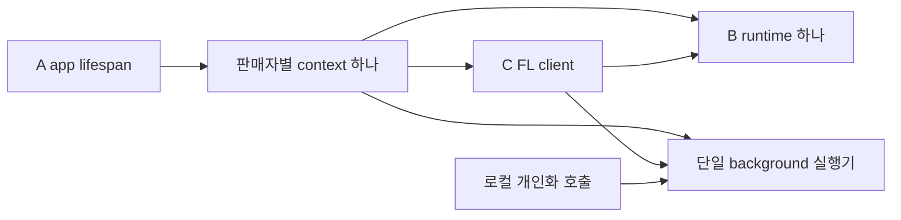

# 개발 시작과 모듈 경계

전체 설계는 [문서 목차](README.md), 담당별 첫 작업은 [팀 시작 안내](team/start.md)를 따른다.

## 현재 실행 가능한 범위

이 코드는 세 파트가 같은 import·함수·반환 타입으로 시작하기 위한 초기 뼈대다. JSON 계약 검사, Python 인터페이스, 판매자 객체 연결, 단일 작업 실행기, health-only 앱이 있다. 주문 저장·NLP·모델 학습·추천·FL 전송·보호 집계는 미구현이다.

```text
python -m venv .venv
.venv\Scripts\python -m pip install -r commerce/requirements-lock.txt
.venv\Scripts\python -m commerce.tools.gate contracts
.venv\Scripts\python -m commerce.tools.gate scaffold
.venv\Scripts\python -m commerce.tools.gate docs
.venv\Scripts\python -m commerce.tools.gate policy
.venv\Scripts\python -m commerce.tools.gate business
.venv\Scripts\python -m commerce.deploy.run_local --smoke --merchants 2
```

Linux/macOS에서는 `.venv/bin/python`을 사용한다. PATH의 `python`은 다른 프로젝트의 가상환경일 수 있으므로 쓰지 않는다. Git Bash처럼 UTF-8로 읽는 콘솔에서 게이트의 한국어 요약 줄이 깨지면 `PYTHONUTF8=1`을 준다. 판정은 영어 마지막 줄로 하므로 결과는 같다. Python 3.11 기준이며 프로젝트 루트에서 실행한다. lock은 검증한 초기 개발 환경이다. 의존성을 바꿀 때 C가 전체 환경 호환성을 확인한다. 아직 PyTorch/NLP 모델 의존성이나 가중치는 설치하지 않는다.

`scaffold` 성공은 기능 완성을 뜻하지 않는다. `a1/b1/b2/c1/g2/g3/g4`는 담당이 selfcheck를 추가하기 전까지 종료 코드 3의 `NOT_IMPLEMENTED`이고, `business`는 이들 중 실패가 없다는 뜻일 뿐이다. health의 200은 프로세스 기동이며 `ready=false`가 업무 미준비를 뜻한다. 런처는 FL를 비활성으로 고정하며 데이터·모델을 만들지 않는다.

## 파트별 시작점

모든 경로는 저장소 루트 기준이다. **기능 개발자는 자기 파트 README → 공통 ports/types → 해당 구현 파일** 순서로 읽는다.

| 파트 | 바로 읽을 파일 |
| --- | --- |
| A 플랫폼 | [merchant README](../commerce/services/merchant_api/README.md), `context.py`, `main.py` |
| B 데이터·모델 | [runtime README](../commerce/packages/recommender/README.md), `runtime.py` |
| C FL·통합 | [FL client README](../commerce/packages/fl_client/README.md), `lifecycle.py` |

소유 경로는 [작업 규칙](team/working-agreement.md) §1, 작업 순서는 각 역할 카드, 먼저 보여줄 결과는 [팀 시작 안내](team/start.md) §2에만 적는다. 여기와 패키지 README에는 되풀이하지 않는다.

각자 구현 전 상대 모듈의 완성을 기다릴 필요는 없다. 호출자 테스트에서 의존성을 주입해 대체한다. 대체 구현의 결과를 실제 모델/보호 검증으로 보고하지 않는다. 공통 API 변경은 영향받는 생산자·소비자와 함께 검토한다.

### 상대 모듈을 대체하는 방법

`open_runtime`이 돌려주는 `UnimplementedRuntime`은 **모든 업무 메서드가 `FeatureNotImplemented`를 낸다.** 성공 경로를 만들려면 호출자가 자기 test double을 주입한다. 저장소에 공용 fake는 없다.

```python
# A의 예: 성공 경로용 double을 자기 소유 경로에 두고 주입한다.
from commerce.services.merchant_api.context import MerchantSettings, build_context

context = build_context(settings, runtime_factory=lambda sid, db, md: MyFakeRuntime(sid))
```

`build_context`의 `runtime_factory`와 `client_factory`가 그 주입점이다. C도 c1의 stub trainer를 같은 방식으로 주입한다.

- double과 테스트는 **자기 소유 경로** 아래 둔다. 예: A는 `commerce/services/merchant_api/tests/`, B는 `commerce/packages/data_adapters/tests/`, C는 `commerce/tests/e2e/`. CI는 테스트를 직접 찾지 않으므로 자기 selfcheck가 호출한다.
- A·C는 `commerce/packages/recommender/runtime.py`를 고쳐 성공을 만들지 않는다. B 소유이며 `gate scaffold`가 기준 stub `UnimplementedRuntime`의 모든 메서드가 예외를 내는지 검사한다. B는 실제 runtime을 별도 클래스로 만들어 `open_runtime`이 그것을 돌려주게 하고, stub 클래스는 남겨 둔다.
- `FeatureNotImplemented`를 잡아 delivered·학습 완료·정상 추천으로 바꾸지 않는다.
- double은 `ports.py`의 시그니처와 `types.py`의 반환 타입을 지킨다. 계약과 다른 모양을 돌려주면 실제 연결에서 다시 깨진다.

### scaffold 검사가 고정하는 것

`gate scaffold`(필수 CI job `scaffold`가 도는 게이트 중 하나)는 [test_scaffold.py](../commerce/tests/e2e/test_scaffold.py)의 두 종류 검사를 실행한다.

- **항상 지킬 경계** (`ScaffoldInvariants`): 판매자별 runtime·실행기 분리, 기준 stub의 미구현 예외, 중앙·coordinator에 판매자 상태와 주문 경로가 없음, 오류 응답 schema. 기준 stub을 직접 주입하므로 A·B의 실제 구현이 결과를 바꾸지 않는다.
- **아직 없는 C 기능** (`NotYetImplemented`): FL 활성화 거부, coordinator 제출 경로 없음. 그 기능을 구현하는 C PR이 같은 PR에서 실제 동작 검사로 바꾼다.

다른 역할의 현재 구현 상태는 여기서 고정하지 않는다. 자기 구현 때문에 scaffold가 깨지면 게이트를 느슨하게 하지 말고 C에게 PR로 알린다. 경계를 어긴 것인지, 테스트가 임시 상태를 고정한 것인지 함께 본다. `MerchantSettings`에 필드를 추가할 때는 기본값을 둔다. scaffold가 기존 세 필드만으로 만든다.

## 고정한 import와 타입

```python
from commerce.packages.contracts.ports import RecommenderRuntime
from commerce.packages.contracts.types import TrainingResult, PersonalizationResult, ComparisonResult
from commerce.packages.contracts.errors import ContractError, FeatureNotImplemented, JobBusyError
from commerce.packages.contracts.ids import canonical_json, purchase_event_id, manifest_hash
from commerce.packages.recommender.runtime import open_runtime
from commerce.packages.fl_client.lifecycle import create_client, FLClientConfig
```

[ports.py](../commerce/packages/contracts/ports.py)가 로컬 함수의 인자·반환 타입 기준이다. [types.py](../commerce/packages/contracts/types.py)의 dataclass는 로컬 반환 객체이며 wire JSON schema가 아니다. 타입 표기 자체가 유효성 검사를 대신하지는 않는다. 기존 JSON 13종은 [계약 목록](contracts.md)과 schema/validator/fixture를 따른다. `sys.path`를 수정하거나 `from contracts ...` 형태를 섞지 않는다. 두 역할이 따로 계산해 같아야 하는 값(정규 JSON, `purchase_event_id`, `manifest_hash`)은 [ids.py](../commerce/packages/contracts/ids.py)를 호출하고 각자 다시 구현하지 않는다.

| 호출자 → 제공자 | 인터페이스 | 의미 |
| --- | --- | --- |
| A → B | `ingest_purchase_event`, `upsert_catalog_item` | 정상 반환은 **영속 반영 완료**. 현 stub은 반드시 미구현 예외 |
| A → B | `predict_local`, `compare_local` | 추천 및 동일 snapshot의 T-G/R-G/T-P/R-P 비교 |
| C client → B | `get_local_data_ref`, `get_shared_manifest`, `export_shared_state` | 로컬 snapshot 참조·실제 manifest·공통 base. 개인화 export 금지 |
| C client → B | `train_round`, `install_release` | 공통 base에서 학습한 delta 반환, 검증 후 새 release 설치 |
| 판매자 로컬 작업 → B | `personalize_local` | 해당 base의 query_proj/scorer만 개인화. 결과는 중앙 미제출 |
| A → C client | `create_client(runtime, jobs, config)`, `await start()`, `await stop()` | 동일 runtime/작업 실행기를 주입하고 lifespan에서 수명 관리 |

## 판매자 객체와 실행기



- 판매자당 웹 worker 1개, context/runtime 하나. 중앙 앱과 coordinator에는 이 객체를 만들지 않는다.
- B runtime 메서드는 **동기 Python API**다. 요청 처리 중 장시간 계산을 이벤트 루프에서 직접 수행하지 않는다.
- `context.jobs.submit(lambda: context.runtime.train_round(...))` 또는 `personalize_local(...)`을 호출한다. 실행기는 중복 학습을 대기열에 쌓지 않고 `JobBusyError`로 거부한다. asyncio 호출자는 반환 Future를 `asyncio.wrap_future`로 기다릴 수 있다.
- C는 별도 프로세스에서 runtime 메모리를 공유하려고 하지 않고 판매자 프로세스 안의 client로 호출한다. jobs 주입은 C가 A 패키지를 import하는 순환 의존을 피한다.
- B도 최종 구현에서 학습 재진입·snapshot·모델 교체를 검증해야 한다. 현재 실행기만으로 이 검증이 끝난 것은 아니다.
- stub 생성은 DB를 만들지 않는다. 향후 주문 DB의 쓰기는 A, 특징/모델의 쓰기는 B, 중앙 집계 registry의 쓰기는 C가 소유한다.

## 실패와 미구현 처리

`ContractError`는 기존 v1 코드와 로컬 `field_path`를 가진다. `to_payload()`는 고객/상품 ID 누출을 막기 위해 상세 경로와 원문을 제거하고 유효한 `contract_error.v1`을 만든다. A가 실제 API를 추가할 때 인증 401, 권한 403, 없음 404, 충돌 409, 검증 422 등 동작에 맞춰 매핑한다.

`FeatureNotImplemented`와 `JobBusyError`는 로컬 예외다. v1 JSON enum에 새 코드를 넣지 않았다. 미구현 예외를 잡아 정상 추천·delivered·학습 완료로 바꾸지 않는다. 현재 FL enabled=true는 protected/synthetic_plaintext 모두 시작 실패한다. 합성 모드조차 입력 출처 확인과 전송 구현이 준비된 뒤 활성화한다.

## 실제 연결 전에 남은 결정

| 항목 | 담당·시점 |
| --- | --- |
| catalog 전달 전 구매 도착의 보류/재시도와 비교 준비 상태 | A/B, 영속 이벤트 연결 전 |
| 모델 없는 fallback의 버전·점수 표현 | A/B/C, 실제 추천 API 연결 전 |
| 학습 목적함수·예제별 특징 cutoff·상품 텍스트 왕복 | B, 소형 본 학습 전 |
| 자동/수동 학습 트리거·재시작 복구·빈 데이터 client 처리 | B/C, 실제 학습 작업 연결 전 |
| 보호 프로토콜·메시지·위협/참여 조건 | C, 실데이터 유래 중앙 FL 전 |
| 실험 실행기에서 부를 집계 core API | B/C, 화면 없는 FL 실험 연결 전 |

이번 뼈대는 import·객체 수명·동기 호출·작업 실행 위치를 고정했다. 위 결정을 임의 기본값으로 숨기지는 않는다.

## 검토와 인계

업무는 `commerce/a|b|c/<작업명>`에서 진행하고 공동 기준은 `main`이다. 작업 시작 전에 `git fetch`로 최신 `main`을 확인한다.

PR에는 변경 동작·호출 예제·검사 명령/결과·미구현/의존성을 남긴다. 공통 계약을 바꿀 때 ports/types 또는 schema와 fixture·소비자·설명을 같은 변경으로 맞춘다. 원자료·개인정보·DB·가중치·비밀은 반영하지 않는다. 다음 담당자는 마지막 PR과 자기 파트 README에서 이어간다.

미확정 사항의 담당·검증 증거는 [열린 구현 항목](design/open-questions.md)에서 함께 관리한다.
