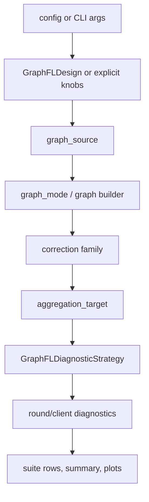

# Framework Design Notes

This document records the current implementation shape of the Graph-FL Design Lab. It is an active design note, not a phase backlog.

## Core Direction

The repository should make graph-FL methods composable and diagnosable. A method is not one large strategy branch. It is a composition of:

1. client state extraction
2. relation estimation
3. topology construction
4. aggregation target
5. delivery/personalization semantics
6. local objective hooks
7. state carried across rounds
8. diagnostics and controls

The implementation should keep those responsibilities in separate modules so a new graph idea can be inserted without rewriting the whole Flower strategy.

## Current Canonical Paths

| Responsibility | Canonical path |
|---|---|
| Method composition metadata | `spectral_fl/designs/` |
| Graph source and signal extraction | `spectral_fl/graph/sources/`, `spectral_fl/graph/signals/` |
| Graph builders and plugin registry | `spectral_fl/graph/builders.py`, `spectral_fl/graph/registry.py` |
| Control graphs and clustering controls | `spectral_fl/graph/controls.py`, `spectral_fl/graph/clustering.py` |
| Graph-FL strategy runtime | `spectral_fl/strategies/graphfl/` |
| Baseline strategies | `spectral_fl/strategies/baselines/` |
| Lifecycle contracts and counterfactual runner | `spectral_fl/lifecycle/` |
| Artifact metrics and writers | `spectral_fl/diagnostics/` |
| Vision run orchestration | `spectral_fl/experiments/vision/` |
| Vision suite grammar/reporting | `spectral_fl/experiments/suites/vision/` |
| Configs | `configs/vision/` |

Compatibility paths such as `run_general_*.py`, `configs/general/...`, `result_general_*`, `general_suite_summary.*`, and `spectral_fl/strategies/spectral/` remain only as wrappers or aliases.

## Runtime Flow

The strategy should orchestrate this flow, not own every algorithmic detail. New relation or topology logic belongs in `graph/`; new aggregation object selection belongs in `strategies/graphfl/targets.py`; new artifact fields belong in `diagnostics/` and suite reporting.

## Naming Policy

`graphfl` is the canonical strategy package name. `spectral` is no longer a project-level identity.

- Use `GraphFLDiagnosticStrategy` in new runtime code.
- Use `spectral_fl.strategies.graphfl` for new imports.
- Use `graph_filtered_update`, `graph_filtered_ema_update`, and `graph_filtered_weight` in new commands.
- Use `graph_filter_strength`, `ours_graph_filtered_*`, and `_graph_filter_only`
  for new configs and suite variants.
- Keep `SpectralConflictAwareStrategy`, `spectral_fl.strategies.spectral`, and `spectral_filtered_*` as compatibility surfaces until a dedicated breaking migration removes them.

The top-level package name `spectral_fl` is still compatibility debt. Renaming it touches every import and Flower app entrypoint, so it is documented rather than changed in this cleanup pass.

## Experiment Philosophy

Performance is not the primary signal. The framework should answer mechanism questions:

- Did the real graph behave differently from matched random, shuffled, identity, or uniform controls?
- Did clustering-only explain most of the effect?
- Did graph-free norm/cap/reweight controls explain the effect?
- Did graph filtering change the update or weight signal in a measurable way?
- Did the method preserve enough effective clients, entropy, and non-dominance to be interpretable?

A run can be useful even if accuracy is not better, as long as it exposes these mechanism traces.

## Minimum Engineering Rules

- Keep CLI modules parser-only.
- Keep experiment modules as orchestration, not algorithm math.
- Keep graph construction independent of Flower strategies.
- Keep `spectral_fl/strategies/spectral/` thin; do not add logic there.
- Add tests around shape, determinism, metadata, and compatibility aliases when adding a new component.
- Run `python -m unittest discover -s tests` and `python scripts/checks/diagnostic_suite_preflight.py` before claiming the repo is ready for experiments.

## Current Known Debt

| Debt | Why not fixed now |
|---|---|
| `spectral_fl` package root | high-risk import and app-entrypoint migration |
| `spectral_filtered_*` lower-level operator outputs | embedded in lifecycle/design tests and historical result metadata |
| `ours_spectral_filtered_*` suite variant aliases | kept for historical result reuse |
| `spectral_filter_strength` compatibility key | still written for historical readers |
| `_spectral_only` / `_speconly` suffix aliases | kept for historical variant parsing |
| `result_general_*` / `general_suite_summary.*` | old reports and readers still need them |
| `configs/general/...` path alias | user commands may still pass old paths |

Those items are tracked in `docs/framework/cleanup-plan.md` and `docs/framework/naming-and-compatibility.md`.
