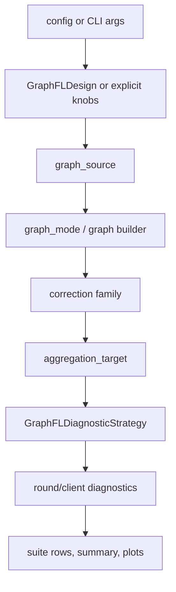

# Framework Design Notes

Active design note for the Graph-FL Design Lab implementation shape.

## Core Direction

Graph-FL methods are component compositions:

```text
client state extraction
relation estimation
topology construction
aggregation target
delivery/personalization semantics
local objective hooks
state carried across rounds
diagnostics and controls
```

## Canonical Paths

| Responsibility | Canonical path |
|---|---|
| Method metadata | `spectral_fl/designs/` |
| Graph source/signal extraction | `spectral_fl/graph/sources/`, `spectral_fl/graph/signals/` |
| Builders and registry | `spectral_fl/graph/builders.py`, `spectral_fl/graph/registry.py` |
| Controls/clustering | `spectral_fl/graph/controls.py`, `spectral_fl/graph/clustering.py` |
| Graph-FL runtime | `spectral_fl/strategies/graphfl/` |
| Baselines | `spectral_fl/strategies/baselines/` |
| Lifecycle/counterfactuals | `spectral_fl/lifecycle/` |
| Metrics/writers | `spectral_fl/diagnostics/` |
| Vision orchestration | `spectral_fl/experiments/vision/` |
| Vision suite/reporting | `spectral_fl/experiments/suites/vision/` |
| Configs | `configs/vision/` |

Compatibility paths:

```text
run_general_*.py
configs/general/...
result_general_*
general_suite_summary.*
spectral_fl/strategies/spectral/
```

## Runtime Flow



Ownership:

| Logic | Location |
|---|---|
| relation/topology | `graph/` |
| aggregation object selection | `strategies/graphfl/targets.py` |
| artifact fields | `diagnostics/` and suite reporting |
| orchestration | `experiments/vision/` |

## Naming Policy

| Use | Name |
|---|---|
| strategy package | `spectral_fl.strategies.graphfl` |
| runtime class | `GraphFLDiagnosticStrategy` |
| aggregation targets | `graph_filtered_update`, `graph_filtered_ema_update`, `graph_filtered_weight` |
| filter key | `graph_filter_strength` |
| suite family | `ours_graph_filtered_*` |
| filter-only suffix | `_graph_filter_only` |

Compatibility debt:

```text
SpectralConflictAwareStrategy
spectral_fl.strategies.spectral
spectral_filtered_*
spectral_fl package root
```

## Experiment Philosophy

Mechanism questions:

```text
real graph vs matched random/shuffled/identity/uniform
clustering-only sufficiency
graph-free norm/cap/reweight sufficiency
measurable update/weight perturbation
effective clients, entropy, non-dominance
```

## Engineering Rules

```text
CLI modules parser-only
experiment modules orchestration-only
graph construction independent of Flower strategies
spectral strategy package remains thin
new component tests cover shape, determinism, metadata, compatibility aliases
```

Checks:

```text
python -m unittest discover -s tests
python scripts/checks/diagnostic_suite_preflight.py
```

## Known Debt

| Debt | Reason |
|---|---|
| `spectral_fl` package root | high-risk import/app-entrypoint migration |
| `spectral_filtered_*` lower-level outputs | historical metadata and tests |
| `ours_spectral_filtered_*` suite aliases | historical result reuse |
| `spectral_filter_strength` key | historical readers |
| `_spectral_only` / `_speconly` suffixes | historical variant parsing |
| `result_general_*` / `general_suite_summary.*` | old reports/readers |
| `configs/general/...` alias | old user commands |

Tracking:

```text
docs/framework/cleanup-plan.md
docs/framework/naming-and-compatibility.md
```
